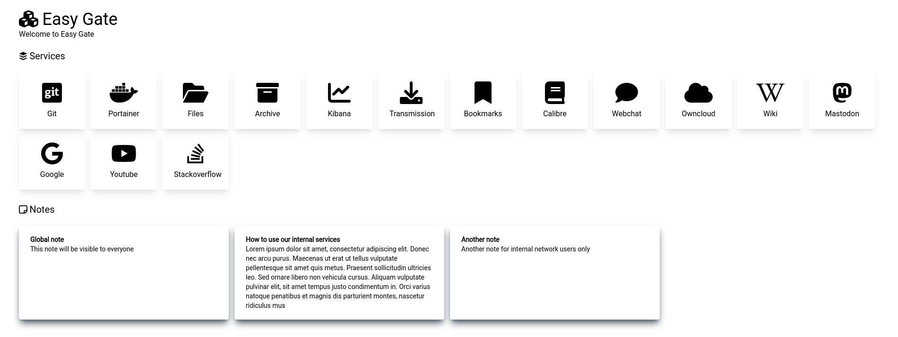

<h1 align="center">
  <a href="https://github.com/r7wx/easy-gate"></a>
  <br />
  easy-gate
</h1>
<h4 align="center">A gate to your self hosted infrastructure</h3>

<p align="center">


<a href="https://github.com/r7wx/easy-gate/actions/workflows/build.yml">
</a>
<a href="https://github.com/r7wx/easy-gate/actions/workflows/test.yml">
</a>
<a href="https://www.codefactor.io/repository/github/r7wx/easy-gate"></a>
</p>

---



<p align="justify">
Easy Gate is a simple web application built in Go and React that acts as the home page for your self-hosted infrastructure. Services and notes are parsed from a configuration file in real-time (without restarting the application). Items can also be assigned to one or more groups to show them only to specific users (based on their IP addresses).
</p>

### Features

- Service and note parsing from a configuration file (JSON/YAML) in real-time (without restarting the application).
- Service and note assignment to one or more groups to show items only to specific users (based on their IP addresses).
- Customizable theme.
- Run as dependecy free standalone executable or as a Docker container.

## Deployment

### Standalone Executable

<p align="justify">
In order to run Easy Gate as a standalone executable, you can build it from source code or download a pre-built binary from the latest release.
</p>

**Build from source:**

```bash
git clone https://github.com/r7wx/easy-gate.git
cd easy-gate
make
```

**Run executable:**

```bash
easy-gate <path-to-config-file>
```

<p align="justify">
Configuration file can be either a JSON or a YAML file.
</p>

### Docker

<p align="justify">
You can deploy an instance of Easy Gate by using Docker:
</p>

```bash
docker run -d --name=easy-gate \
  -p 8080:8080 \
  -v /path/to/easy-gate.json:/etc/easy-gate/easy-gate.json \
  --restart unless-stopped \
  r7wx/easy-gate:latest
```

<p align="justify">
By default the Easy Gate image will look for a configuration file in /etc/easy-gate/easy-gate.json, but this value can be overridden by using the EASY_GATE_CONFIG_PATH environment variable:
</p>

```bash
docker run -d --name=easy-gate \
  -p 8080:8080 \
  -v /path/to/easy-gate.yml:/another/path/easy-gate.yml \
  --restart unless-stopped \
  -e EASY_GATE_CONFIG_PATH=/another/path/easy-gate.yml \
  r7wx/easy-gate:latest
```

### Docker Compose

You can run Easy Gate by using the provided docker-compose file:

```yml
services:
  easy-gate:
    image: r7wx/easy-gate:latest
    build: .
    container_name: easy-gate
    restart: unless-stopped
    ports:
      - 8080:8080
    volumes:
      - ./easy-gate.json:/etc/easy-gate/easy-gate.json
```

```bash
docker-compose up
```

<p align="justify">
By default the Easy Gate image will look for a configuration file in /etc/easy-gate/easy-gate.json, but this value can be overridden by using the EASY_GATE_CONFIG_PATH environment variable:
</p>

```yml
services:
  easy-gate:
    image: r7wx/easy-gate:latest
    build: .
    container_name: easy-gate
    restart: unless-stopped
    environment:
      - EASY_GATE_CONFIG_PATH=/etc/easy-gate/easy-gate.yml
    ports:
      - 8080:8080
    volumes:
      - ./easy-gate.yml:/etc/easy-gate/easy-gate.yml
```

### Docker Compose (behind nginx)

<p align="justify">
If you need to host Easy Gate behind an already running nginx instance (or other reverse proxies), you can use the docker-compose file in the examples directory:
</p>

```yml
services:
  easy-gate:
    image: r7wx/easy-gate:latest
    container_name: easy-gate
    expose:
      - 8080
    networks:
      - nginx-net
    volumes:
      - ../easy-gate.json:/etc/easy-gate/easy-gate.json

  nginx:
    image: nginx:latest
    container_name: nginx
    ports:
      - 80:80
    networks:
      - nginx-net
    volumes:
      - ./nginx.conf:/etc/nginx/conf.d/default.conf

networks:
  nginx-net:
    driver: bridge
```

<p align="justify">
In order to correctly use the groups feature, the nginx instance (or your other reverse proxy) must be configured to use the X-Forwarded-For header:
</p>

```nginx
[...]
location / {
  proxy_set_header X-Forwarded-For $proxy_add_x_forwarded_for;
  proxy_pass http://easy-gate:8080;
}
[...]
```

It is also mandatory to set "behind_proxy" to true in your configuration file:

```json
[...]
"behind_proxy": true,
[...]
```

You can find the complete docker-compose and nginx configuration files in the examples directory. The same logic applies to standalone and Docker deployments.

## Configuration

<p align="justify">
Easy gate can be configured by a JSON or a YAML configuration file. An example configuration is provided in the root directory of this repository (easy-gate.json/easy-gate.yml).
</p>

### Options

- **addr:** IP address to listen on
- **use_tls:** If true, the application will use TLS
- **cert_file:** Path to the SSL certificate file (if TLS is enabled)
- **key_file:** Path to the SSL key file (if TLS is enabled)
- **behind_proxy:** If true, the application will use the X-Forwarded-For header to determine the IP address of the client
- **title:** Title of the application
- **icon:** Font-awesome icon to use as the application icon
- **motd:** Message to display on home page

### Theme

<p align="justify">
Easy Gate theme can be configured by providing colors for background and foreground. Theme changes will be applied immediately.
</p>

Example of a dark mode theme:

#### JSON

```json
"theme": {
  "background": "#1d1d1d",
  "foreground": "#ffffff"
}
```

#### YAML

```yml
theme:
  background: "#FFFFFF"
  foreground: "#000000"
```

### Groups

<p align="justify">
Group entries are used to define which users can see which items, by providing the user subnet:
</p>

#### JSON

```json
"groups": [
  {
    "name": "internal",
    "subnet": "192.168.1.1/24"
  },
  {
    "name": "vpn",
    "subnet": "10.8.1.1/24"
  }
]
```

#### YAML

```yml
groups:
  - name: internal
    subnet: 192.168.1.1/24
  - name: vpn
    subnet: 10.8.1.1/24
```

### Services

<p align="justify">
A service entry is used to define a service that is available in the infrastructure. Each service has a name, an url, an icon and the groups that can see it (defined in the groups section). If no group is provided the item can be seen by all users:
</p>

#### JSON

```json
{
  "icon": "fa-brands fa-git-square",
  "name": "Git",
  "url": "https://git.example.vpn",
  "groups": [
      "vpn"
  ]
},
{
  "icon": "fa-brands fa-docker",
  "name": "Portainer",
  "url": "https://portainer.example.internal",
  "groups": []
}
```

#### YAML

```yml
- icon: fa-brands fa-git-square
  name: Git
  url: https://git.example.vpn
  groups:
    - vpn
- icon: fa-brands fa-docker
  name: Portainer
  url: https://portainer.example.internal
  groups: []
```

### Notes

<p align="justify">
A note entry is used to define a simple text note which has a title and a content. Each note has a name, the note content (text) and the groups that can see it (defined in the groups section). If no group is provided the item can be seen by all users:
</p>

#### JSON

```json
{
  "name": "Simple note",
  "text": "This is a simple note for vpn users",
  "groups": [
    "vpn"
  ]
},
{
  "name": "Global note",
  "text": "This note will be visible to everyone",
  "groups": []
}
```

#### YAML

```yml
- name: Simple note
  text: This is a simple note for vpn users
  groups:
    - vpn
- name: Global note
  text: This note will be visible to everyone
  groups: []
```

### Icons

Icons are provided by the [Font Awesome](https://fontawesome.com/icons?d=gallery) library. Get the appropriate icon name by using the Font Awesome website (only free icons are available).

### Environment Variables

- **EASY_GATE_CONFIG_PATH:** Easy Gate configuration file path can be provided by this environment variable. The value will have precedence over the configuration file path provided in the command line.
- **EASY_GATE_CONFIG:** Insted of providing a configuration file, it is possible to provide the entire configuration as a JSON or YAML string in this environment variable. The content of this variable will have precedence over the configuration file.
